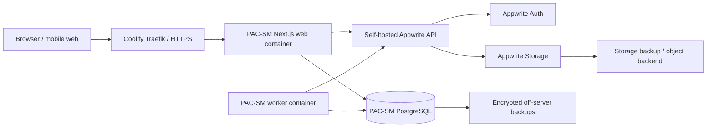
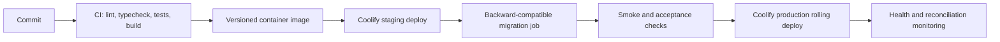

# PAC-SM Total Code Implementation Plan

**Status:** Proposed for review  
**Hosting target:** Self-hosted Coolify  
**Platform integration:** Self-hosted Appwrite  
**Architecture:** Next.js modular monolith with PostgreSQL transactional core

## 1. Final Platform Boundary

PAC-SM will use each platform for the work it is best suited to do:

| System | Responsibility |
|---|---|
| Coolify | Build, deploy, route, monitor, roll back, and supply runtime secrets to PAC-SM containers. |
| Next.js application | Customer Marketplace, Seller Centre, Admin Centre, API boundaries, authorization, workflows, and business rules. |
| PAC-SM worker | Transactional-outbox processing, notifications, reservation expiry, reconciliation, and scheduled jobs. |
| PostgreSQL | Authoritative marketplace data: businesses, vendors, catalogue, offers, inventory, carts, orders, finance, settlements, RBAC assignments, and audit records. |
| Self-hosted Appwrite Auth | User identity, credentials, verification, password recovery, MFA-ready sessions, and OAuth when enabled. |
| Self-hosted Appwrite Storage | Public product media and private KYC/KYB documents with distinct buckets and permissions. |
| Appwrite Messaging (optional) | Email/SMS delivery after the core notification adapter is proven. |

Appwrite TablesDB/Databases will not duplicate the PAC-SM transactional model. Splitting orders, inventory, and ledger records between Appwrite and PostgreSQL would weaken atomic transactions and reconciliation. Appwrite user IDs are stored as external identity references in PAC-SM PostgreSQL.

## 2. Runtime Topology



Recommended production domains:

- `market.example.com` — PAC-SM application
- `appwrite.example.com` — Appwrite API/console routing, with console access restricted
- Separate staging domains and isolated Appwrite project/database

The application and Appwrite may share a server initially, but they must remain separate Coolify resources with explicit CPU/memory/storage limits. For resilience and scale, PostgreSQL backups and Appwrite storage backups must leave the server.

## 3. Authentication and Identity Design

### Sign-in flow

1. The browser submits credentials to a PAC-SM server endpoint.
2. The server uses Appwrite's server SDK to create an Appwrite session.
3. The Appwrite session secret is stored only in a secure, HTTP-only, SameSite cookie.
4. For each protected request, PAC-SM resolves the Appwrite account server-side.
5. PAC-SM maps `appwrite_user_id` to `users.appwrite_user_id` in PostgreSQL.
6. PAC-SM loads business memberships, vendor relationships, roles, and permissions from PostgreSQL.
7. The application service authorizes the action and tenant before querying domain records.

Appwrite authenticates the person; PAC-SM authorizes marketplace actions. Appwrite team membership or client-side labels must never replace PAC-SM's server-side RBAC and tenant rules.

### Identity consistency

- `users.appwrite_user_id` is unique and immutable.
- User provisioning is idempotent and occurs only after Appwrite identity verification rules pass.
- Appwrite account deletion does not cascade into PAC-SM commercial history; the PostgreSQL user becomes disabled/anonymized according to retention policy.
- Email/phone updates arrive through a verified synchronization use case and are audited.
- Admin access requires a PAC-SM privileged role in PostgreSQL; Appwrite Console access does not grant marketplace administration.

## 4. Appwrite Resource Plan

Create separate Appwrite projects for local/test, staging, and production.

### Buckets

| Bucket | Access | Contents | Controls |
|---|---|---|---|
| `product-media` | Public read only after offer/product approval; server write | Product and store images | MIME allowlist, size limit, image decode, generated IDs, transformations, moderation state. |
| `kyc-private` | No public read; privileged server access only | Identity, company, tax, licence, and bank evidence | Encryption key backed up, antivirus enabled, short-lived downloads, audit on every read, strict retention. |
| `order-private` | Customer/vendor/admin policy through server only | Future invoices, return evidence, proof documents | Tenant checks before file token/view response. |

Store only Appwrite bucket/file IDs, checksum, classification, owner, and status in PostgreSQL. Do not persist signed URLs.

### API keys

Use separate least-privilege server keys where Appwrite permits:

- authentication/session service key;
- public-media upload/management key;
- private-document key;
- worker/messaging key.

Keys are runtime-only locked secrets in Coolify, never `NEXT_PUBLIC_*`, never build arguments, and never logged.

### Self-hosting controls

- Production mode and forced HTTPS enabled.
- Abuse protection/rate limiting stays enabled.
- `_APP_OPENSSL_KEY_V1` is strong, locked, rotated only under a migration plan, and backed up securely; losing it can make encrypted data unusable.
- Appwrite Console registration is restricted; console access is limited by identity/network controls.
- Antivirus scanning is enabled for private uploads with the required ClamAV service.
- SMTP, allowed origins/platform hostnames, storage limits, and retention are explicitly configured.
- Appwrite services, database, Redis, and storage volumes have health monitoring, resource limits, log rotation, and tested backups.
- Appwrite version upgrades are pinned, rehearsed in staging, and paired with backup/rollback procedures.

## 5. Coolify Deployment Plan

### Resources

1. `pac-sm-web`: Dockerfile-built Next.js standalone container.
2. `pac-sm-worker`: same versioned image, worker entry command, no public domain.
3. `pac-sm-postgres`: private managed PostgreSQL resource.
4. Existing self-hosted Appwrite stack: separate resource/stack and lifecycle.

Use a repository-owned multi-stage Dockerfile for repeatable builds. Coolify should deploy the web and worker from the same Git commit/image. PostgreSQL and Appwrite must not be rebuilt during normal PAC-SM application deployment.

### Release workflow



- `/api/health/live` verifies the process.
- `/api/health/ready` verifies required dependencies with a short timeout.
- Health checks gate Coolify traffic and rolling updates.
- Graceful shutdown stops new work and allows current requests/jobs to finish.
- Migrations run once as an explicit release task, never independently in every web replica.
- Database migrations use expand/migrate/contract sequencing; destructive contract steps occur only after old code is gone and backups are verified.
- Rollback returns to a compatible image; it does not blindly reverse financial migrations.

### Secrets and environment

Maintain a secret-free `.env.example`. Configure real values as locked, runtime-only Coolify variables:

```text
NODE_ENV
APP_BASE_URL
DATABASE_URL
APPWRITE_ENDPOINT
APPWRITE_PROJECT_ID
APPWRITE_AUTH_API_KEY
APPWRITE_STORAGE_API_KEY
APPWRITE_PRODUCT_MEDIA_BUCKET_ID
APPWRITE_KYC_BUCKET_ID
SESSION_COOKIE_DOMAIN
APP_ENCRYPTION_KEY
LOG_LEVEL
OTEL_EXPORTER_OTLP_ENDPOINT
ERROR_REPORTING_DSN
```

Only the Appwrite endpoint and project ID may be exposed to browser code if a client SDK is deliberately used. Phase 1 will prefer server-mediated operations to keep authorization centralized.

## 6. Repository Deliverables

```text
pac-sm/
  app/
    (marketplace)/
    seller/
    admin/
    api/
      appwrite/
      health/live/
      health/ready/
  src/
    modules/
      auth/ authorization/ users/
      businesses/ vendors/ stores/
      catalogue/ offers/ inventory/
      customers/ cart/ checkout/ orders/
      payments/ accounting/ wallets/ settlements/
      admin/ audit/ notifications/
    integrations/
      appwrite/auth/
      appwrite/storage/
      payments/
      logistics/
    shared/
      domain/ application/ infrastructure/
      validation/ security/ observability/ config/
    db/
      schema/ migrations/ seeds/
    workers/
  components/
    ui/ marketplace/ seller/ admin/
  tests/
    unit/ integration/ acceptance/ security/ fixtures/
  docs/
    adr/ runbooks/
  Dockerfile
  docker-compose.local.yml
  .dockerignore
  .env.example
  package.json
  README.md
```

`docker-compose.local.yml` is for local development only. Production database credentials, volumes, routing, and backups are owned through Coolify resources.

## 7. Complete Implementation Sequence

### Phase 0 — Decisions and platform foundation

1. Approve pilot country/currency, marketplace policies, finance rules, and RBAC matrix.
2. Record architecture decisions for Appwrite identity boundary, Drizzle/PostgreSQL, ledger structure, and Coolify deployment.
3. Create repository, Next.js/TypeScript foundation, module boundaries, CI, Dockerfile, health endpoints, and environment validation.
4. Provision isolated development/staging resources and Appwrite projects/buckets.
5. Establish migrations, seed framework, structured logs, tracing, error reporting, audit framework, and transactional outbox worker.
6. Complete threat model, backup/restore drill, secret handling, dependency scanning, and incident runbooks.

**Gate:** reproducible build, healthy Coolify staging deploy, Appwrite connectivity, fresh migration, and restore proof.

### Phase 1A — Identity, RBAC, business, vendor

1. Appwrite SSR signup/sign-in/sign-out/verification/reset/session flow.
2. PostgreSQL user projection and idempotent identity synchronization.
3. Roles, permissions, scoped assignments, policy service, authorization test matrix.
4. Business profiles and memberships.
5. Vendor application, explicit lifecycle, document metadata, private Appwrite uploads, review events, approval, immutable merchant ID, and store activation.

**Gate:** vendor isolation and KYC access security tests pass.

### Phase 1B — Catalogue, offers, and inventory

1. Category and brand administration.
2. Canonical products, structured variants, media, and moderation state machine.
3. Vendor seller offers with price, currency, SKU, MOQ, fulfilment, and approval.
4. Warehouses, inventory balances, append-only movements, atomic reservations, expiry/release, and concurrency control.
5. Seller product/inventory workflows and approved public storefront reads.

**Gate:** last-unit concurrent checkout/reservation test proves no overselling.

### Phase 1C — Customer, cart, checkout, and orders

1. Customer profile, address book, catalogue browsing, search/filter baseline.
2. Multi-vendor cart with grouped presentation and server-authoritative revalidation.
3. Atomic checkout use case: reserve inventory, snapshot terms, create one parent order, vendor orders, items, status events, and outbox notifications.
4. Controlled parent/vendor order state machines and vendor-isolated order views.
5. Admin complete-order view and operational audit trail.

**Gate:** one-cart/two-vendor order split test passes with exact tenant visibility.

### Phase 1D — Simulated finance and settlement

1. Chart of accounts and balanced journal posting service.
2. Idempotent simulated payment attempt/capture.
3. Effective-dated commission rules and immutable per-line/vendor-order calculation snapshots.
4. Vendor wallets as ledger projections: pending, available, reserved, settled.
5. Delivery-triggered eligibility, settlement simulation, settlement items, reconciliation reports, and reversal flows.

**Gate:** zero-difference reconciliation and duplicate-event tests pass.

### Phase 1E — Product surfaces and hardening

1. Customer Marketplace core pages and responsive checkout.
2. Seller Centre: overview, store, products, inventory, orders, wallet, team, compliance.
3. Admin Centre: vendor review, moderation, orders, finance, settlement, audit.
4. Accessibility, low-bandwidth performance, error states, support diagnostics, rate controls, and security review.
5. Complete seeded acceptance scenario in CI and Coolify staging.

**Gate:** all Phase 1 acceptance tests, recovery checks, and operational runbooks approved.

### Phase 2 — Real payments and financial controls

- Provider abstraction, initial Paystack/Flutterwave adapter selection, signed webhooks, replay prevention, payment verification, refunds, reconciliation, manual payout controls, and settlement reports.
- No automated payout until segregation of duties, limits, reconciliation, and incident rollback are proven.

### Phase 3 — Logistics

- Provider/service-level adapters, vendor fulfilment, PAC-SM logistics, shipments, packages, tracking events, courier assignment, proof of delivery, exceptions, and idempotent callbacks.

### Phase 4 — Returns and trust

- Return eligibility, evidence in private Appwrite storage, inspection, refund/replacement, disputes, verified-purchase reviews, seller performance, enforcement, and support workflows.

### Phase 5 — Wholesale

- Business buyers, tier prices, MOQ, bulk cart, proforma invoice, purchase order, commercial approval, and wholesale reporting.

### Phase 6 — RFQ and procurement

- RFQs, supplier matching, invitations, quotations, comparison, negotiation history, approvals, and conversion to contract/order.

### Phase 7 — Fulfilled by PAC-SM

- PAC-SM warehouses, locations/bins, inbound notices, receiving, put-away, picking, packing, dispatch, returns, cycle counts, and reconciliation.

### Phase 8 — Trade infrastructure

- Digital Trade Passport, certification/inspection records, export readiness, trade documents, cross-border order data, customs interfaces, and controlled trade-finance integration boundaries.

### Phase 9 — APIs and enterprise integration

- Versioned merchant APIs, scoped service credentials, inventory/orders APIs, signed webhooks, rate limits, sandbox, ERP/POS/logistics connectors, and developer documentation.

### Phase 10 — Scale and intelligence

- Introduce Redis, queues, dedicated search, read models, analytics warehouse, fraud signals, recommendations, and forecasting only from measured requirements.
- Extract a module into a service only when scaling, ownership, availability, or deployment independence provides a demonstrated benefit.

## 8. Test Strategy

| Layer | What it proves |
|---|---|
| Unit | Domain calculations, state transitions, policy decisions, IDs, rounding, and validation. |
| PostgreSQL integration | Constraints, migrations, isolation, locks, reservations, order split, journals, and idempotency against real PostgreSQL. |
| Appwrite contract | SSR session behavior, identity mapping, bucket permissions, private document denial, and unavailable-service handling. |
| API/component | Boundary validation, accessible behavior, and safe error responses. |
| Playwright acceptance | Customer, seller, and admin workflows across roles and mobile/desktop layouts. |
| Security | Tenant-ID substitution, privilege escalation, upload abuse, CSRF, session expiry, rate controls, and secret/log leakage. |
| Operational | Docker health, graceful shutdown, migration-once behavior, backup restore, rollback compatibility, and worker retry/dead-letter behavior. |
| Finance reconciliation | Every Phase 1 order/payment/commission/earning/settlement agrees with journals at zero difference. |

Appwrite contract tests run against a dedicated non-production Appwrite project. Tests must never delete or mutate production identities or files.

## 9. Backup and Disaster Recovery

- PostgreSQL: automated scheduled full backups through Coolify plus off-server S3-compatible retention; add WAL/PITR where the selected PostgreSQL deployment supports it.
- Appwrite: back up its database, Redis/configuration requirements, storage volumes/object backend, `.env`, and `_APP_OPENSSL_KEY_V1` through the Appwrite-supported procedure.
- Coolify: back up Coolify configuration/database separately from application data.
- Encrypt backups, separate credentials, test restoration quarterly at minimum, and record recovery time and recovery point results.
- A backup is not accepted until a staging restoration proves accounts, product files, private documents, transactional rows, and ledger reconciliation.

## 10. Definition of Ready to Start Coding

Coding can begin after these inputs are supplied or explicitly defaulted:

- Appwrite endpoint, project ID, API-key creation authority, and whether trusted HTTPS is already configured.
- Coolify Git source/deployment access and target domains.
- Pilot country, currency, language, fulfilment mode, tax approach, commission/rounding rules, settlement delay, and return window.
- Staging and production isolation plan.
- Backup destination and retention policy.
- Approved RBAC matrix and KYC document list.

## 11. Recommended Defaults if Not Otherwise Specified

- Pilot: Nigeria, English, NGN only.
- Phase 1 fulfilment: fulfilled by vendor plus simulated PAC-SM logistics status; no live courier.
- Authentication: Appwrite email/password with verification and server-side sessions; MFA architecture prepared but not mandatory for customers in V1.
- PostgreSQL: Coolify private resource, not publicly exposed.
- Deployment: repository Dockerfile, one web container and one worker, rolling update gated by health checks.
- Storage: Appwrite public product bucket and private KYC bucket.
- Finance: integer kobo, explicit half-up rounding at defined calculation boundaries, configurable commission, simulated payment/settlement only.

This plan authorizes progressive implementation only after review. It does not change the core requirement that tenant isolation, inventory integrity, financial reconciliation, and auditability take priority over delivery speed.

## 12. Reference Basis

The deployment decisions align with the official documentation for [Coolify build packs](https://coolify.io/docs/applications/build-packs), [Coolify health checks](https://coolify.io/docs/knowledge-base/health-checks), [Coolify environment variables](https://coolify.io/docs/knowledge-base/environment-variables), [Coolify PostgreSQL backups](https://coolify.io/docs/databases/backups), [Appwrite SSR authentication](https://appwrite.io/docs/products/auth/server-side-rendering), [Appwrite self-hosted environment configuration](https://appwrite.io/docs/advanced/self-hosting/configuration/environment-variables), and [Appwrite production scaling guidance](https://appwrite.io/docs/advanced/self-hosting/production/scaling).
