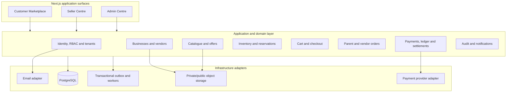
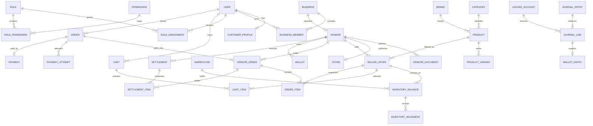

# PAC-SM Phase 0 and Phase 1 Architecture Plan

**Status:** Proposed for review  
**Scope:** Architecture and implementation planning only  
**Governing specification:** PAC-SM Codex Master Build Specification  
**Target deliverable:** PAC-SM Marketplace Core V1  
**Deployment target:** Self-hosted Coolify with self-hosted Appwrite integration

## 1. Executive Architecture Decision

PAC-SM will begin as a domain-oriented modular monolith. One deployable Next.js application will contain the customer marketplace, Seller Centre, Admin Centre, server-side application services, and background-job entry points. PostgreSQL will be the transactional source of truth. Module boundaries, explicit service interfaces, and an append-oriented event/ledger design will allow high-load capabilities to be extracted later without prematurely adopting microservices.

The first release proves the marketplace's hardest foundation: one checkout containing products from multiple vendors becomes one parent order and isolated vendor orders, with exact inventory, commission, wallet, and settlement records.

### Architectural principles

- PostgreSQL is authoritative for identity, tenancy, catalogue, inventory, orders, and finance.
- UI code never owns business rules; route handlers/server actions call application services.
- Every protected operation is authorized server-side against role, permission, resource, and tenant.
- Financial values use integer minor units plus ISO 4217 currency codes; no floating point.
- Inventory and financial mutations run in database transactions with locks or atomic conditions.
- Historical commercial snapshots are immutable even when products, prices, or rules later change.
- External systems sit behind adapters and idempotent integration boundaries.
- Audit, order, inventory, and ledger histories are append-oriented.
- Country-specific behavior is configuration-driven, not embedded in core domain logic.

## 2. Proposed System Architecture



### Request flow

1. A browser request reaches a Next.js route, server action, or API endpoint.
2. The boundary validates the request and obtains the authenticated principal.
3. The application service verifies global and tenant-scoped authorization.
4. The domain service applies state-transition and transaction rules.
5. A repository performs scoped database operations inside a transaction.
6. Domain events are written to a transactional outbox in the same commit.
7. A worker processes notifications and other retryable side effects idempotently.

### Deployment topology for V1

- Stateless web/application instances deployed as containers through Coolify behind HTTPS.
- Managed PostgreSQL with encrypted connections, automated backups, point-in-time recovery, and separate credentials per environment.
- Self-hosted Appwrite Authentication for user credentials and sessions; PAC-SM PostgreSQL remains authoritative for RBAC and tenant authorization.
- Self-hosted Appwrite Storage with separate public product-media and private KYC document buckets.
- A worker process using the same codebase for outbox jobs.
- Centralized structured logs, error reporting, health checks, and audit monitoring.
- Local, test, staging, and production environments with isolated data and credentials.

Redis, dedicated search, and a distributed queue are deferred until measured load or reliability requirements justify them. PostgreSQL full-text search and a transactional outbox are sufficient for Phase 1.

## 3. Domain Boundaries

| Module | Owns | May expose |
|---|---|---|
| Identity | users, credentials, sessions, verification, MFA readiness | authenticated principal |
| Authorization | roles, permissions, assignments, policy evaluation | `authorize(action, resource, tenant)` |
| Businesses | businesses, members, business roles | verified business context |
| Vendors | applications, documents, reviews, merchant ID, vendor status | approved vendor profile |
| Stores | storefront identity and policies | public store read model |
| Catalogue | categories, brands, products, variants, moderation | approved product data |
| Offers | vendor-specific price, SKU, MOQ, availability, status | purchasable offer snapshot |
| Inventory | warehouses, stock balances, reservations, movements | reserve, release, commit |
| Customers | customer profile and addresses | checkout identity/address |
| Cart | multi-vendor cart and price candidates | validated checkout intent |
| Orders | parent orders, vendor orders, items, state transitions | order lifecycle |
| Finance | simulated payments, accounting journals, commission, wallets, settlement | reconciled financial state |
| Admin | moderation and operational use cases | privileged workflows only |
| Audit | immutable security and business action records | traceability |
| Notifications | outbox-backed delivery | retryable messages |

Cross-module writes occur through application services, never by importing another module's internal repository.

## 4. Phase 0 Roadmap — Foundation

### 0.1 Product and operating decisions

- Confirm Phase 1 pilot country, currency, language, supported product types, tax treatment, and fulfilment modes.
- Approve vendor onboarding, moderation, return, settlement, data-retention, and prohibited-goods policies.
- Define role/permission matrix and financial approval limits.
- Define service-level objectives, recovery objectives, and incident ownership.

**Exit:** signed architecture decision record and marketplace rule baseline.

### 0.2 Engineering foundation

- Initialize TypeScript/Next.js repository, formatting, linting, tests, commit hooks, and CI.
- Establish environment validation, secret handling, structured logging, error reporting, and health endpoints.
- Configure PostgreSQL, ORM, migration workflow, deterministic seed data, and test database isolation.
- Create module dependency rules and architecture decision record template.

**Exit:** clean build and CI with reproducible local/test setup.

### 0.3 Security foundation

- Threat-model authentication, tenant boundaries, administration, KYC uploads, checkout, and ledger operations.
- Implement secure session baseline, CSRF protection where applicable, security headers, rate limiting strategy, and audit schema.
- Define backup restoration, key rotation, access review, vulnerability response, and dependency update procedures.

**Exit:** threat model reviewed; critical controls have owners and tests.

### 0.4 Data foundation

- Approve naming, IDs, timestamps, money, currency, country, status, soft-retention, and audit conventions.
- Review initial ERD, transaction boundaries, indexes, unique constraints, and deletion policies.
- Establish migration roll-forward/rollback and production change review policy.

**Exit:** schema proposal approved before the first migration is authored.

## 5. Phase 1 Roadmap — Marketplace Core V1

Implementation proceeds in vertical increments; every increment includes migration, service authorization, tests, audit coverage, and documentation.

1. **Identity and RBAC:** registration, sign-in, email verification, password reset, sessions, roles, permissions, and server-side policy checks.
2. **Businesses and vendors:** business membership, vendor application, KYC/KYB metadata, review workflow, explicit statuses, immutable merchant ID, and store activation.
3. **Catalogue and offers:** categories, brands, canonical products, structured variants, vendor offers, moderation, and storefront presentation.
4. **Inventory:** warehouses/locations, auditable inventory movements, atomic reservations, release/commit rules, and availability reads.
5. **Customer marketplace and cart:** approved offer browsing, search/filter baseline, customer address, multi-vendor cart, and server-side price revalidation.
6. **Order engine:** atomic checkout, parent order, vendor orders, immutable line snapshots, controlled transitions, and isolated seller views.
7. **Simulated finance:** one captured simulated payment, configurable commission snapshots, balanced journal entries, vendor pending earnings, wallet views, eligibility, and settlement simulation.
8. **Seller Centre:** vendor-scoped overview, products, inventory, orders, wallet, and team access appropriate to Phase 1.
9. **Admin Centre:** vendor approval, product moderation, complete order view, financial overview, settlement simulation, and audit inspection.
10. **Hardening and acceptance:** concurrency, authorization, idempotency, recovery, accessibility, responsive flows, seeded scenario, and reconciliation report.

### Phase 1 exclusions

Real payment capture/webhooks, automatic payouts, live courier integrations, full returns/disputes, RFQ, wholesale procurement, warehousing operations, trade finance, native mobile applications, and microservices are explicitly deferred.

## 6. Initial PostgreSQL Schema

### Conventions

- Internal primary keys: UUID/UUIDv7-compatible values.
- Public references: separate immutable unique strings such as `PAC-ORD-2026-000001`.
- All timestamps: timezone-aware UTC.
- Money: `BIGINT amount_minor` plus `CHAR(3) currency_code`.
- Mutable records: `created_at`, `updated_at`, and optimistic `version` where concurrent editing matters.
- Enumerated lifecycle values: PostgreSQL enum or constrained text, changed only through reviewed migrations.
- Sensitive documents: object-storage key and metadata only; never public URLs or database blobs.
- Tenant-owned tables include `vendor_id` or `business_id` and matching composite indexes.

### Identity, business, and authorization

- `users(id, public_id, email, phone, password_hash, email_verified_at, status, created_at)`
- `sessions(id, user_id, token_hash, expires_at, revoked_at, metadata)`
- `businesses(id, public_id, legal_name, trading_name, registration_number, tax_id, country_code, status)`
- `business_members(id, business_id, user_id, status, joined_at)`; unique `(business_id, user_id)`
- `roles(id, code, scope_type)` and `permissions(id, code)`
- `role_permissions(role_id, permission_id)`
- `role_assignments(id, user_id, role_id, business_id nullable, vendor_id nullable)`
- `vendors(id, business_id, merchant_id, type, status, approved_at, activated_at)`; unique immutable `merchant_id`, one Phase 1 vendor per business
- `vendor_applications(id, vendor_id, status, submitted_at, decided_at)`
- `vendor_documents(id, vendor_id, type, storage_key, mime_type, checksum, status, expires_at)`
- `vendor_review_events(id, application_id, actor_user_id, action, reason, metadata, created_at)`
- `stores(id, vendor_id, name, slug, description, status, policies_json)`; unique `slug`

### Catalogue and inventory

- `categories(id, parent_id, name, slug, status)`
- `brands(id, name, slug, status)`
- `products(id, public_id, category_id, brand_id, name, slug, description, origin_country_code, status, approval_status)`
- `product_variants(id, product_id, public_id, sku_reference, barcode, attributes_json, weight_grams, dimensions_json, status)`
- `product_media(id, product_id, variant_id nullable, storage_key, media_type, position, alt_text)`
- `seller_offers(id, vendor_id, product_id, variant_id, seller_sku, retail_price_minor, wholesale_price_minor nullable, promotional_price_minor nullable, currency_code, min_qty, max_qty, fulfilment_method, processing_time_hours, status, approval_status)`; unique `(vendor_id, seller_sku)`
- `warehouses(id, vendor_id nullable, public_id, name, type, country_code, status)`
- `inventory_balances(id, offer_id, warehouse_id, on_hand, reserved, incoming, damaged, version)`; unique `(offer_id, warehouse_id)`
- `inventory_reservations(id, order_id nullable, cart_id nullable, offer_id, warehouse_id, quantity, status, expires_at, idempotency_key)`
- `inventory_movements(id, offer_id, warehouse_id, reservation_id nullable, type, quantity_delta, reference_type, reference_id, actor_user_id nullable, created_at)`

`available = on_hand - reserved - damaged`; a database constraint prevents negative component quantities, and reservation services use an atomic conditional update/row lock.

### Customer, cart, and order

- `customer_profiles(id, user_id, display_name)`; unique `user_id`
- `addresses(id, user_id, label, recipient_name, phone, lines_json, city, region, postal_code, country_code)`
- `carts(id, user_id, currency_code, status, expires_at)`
- `cart_items(id, cart_id, offer_id, quantity, fulfilment_method, observed_price_minor, created_at)`; unique `(cart_id, offer_id, fulfilment_method)`
- `orders(id, public_number, customer_user_id, currency_code, status, subtotal_minor, shipping_minor, tax_minor, discount_minor, total_minor, shipping_address_snapshot, idempotency_key, placed_at)`
- `vendor_orders(id, public_number, order_id, vendor_id, status, subtotal_minor, shipping_minor, tax_minor, discount_minor, commission_minor, vendor_earning_minor)`; unique `(order_id, vendor_id)` in Phase 1
- `order_items(id, order_id, vendor_order_id, vendor_id, product_id, variant_id, offer_id, product_name_snapshot, variant_snapshot, seller_sku_snapshot, unit_price_minor, quantity, line_total_minor, commission_rule_id, commission_minor)`
- `order_status_events(id, order_id, vendor_order_id nullable, event_type, from_status, to_status, actor_user_id nullable, metadata, created_at)`

### Finance and audit

- `payment_attempts(id, order_id, provider, provider_reference, idempotency_key, amount_minor, currency_code, status, created_at)`
- `payments(id, public_id, order_id, amount_minor, currency_code, status, captured_at)`; one successful simulated Phase 1 payment per order
- `payment_transactions(id, payment_id, type, provider_reference, amount_minor, status, raw_reference, created_at)`
- `commission_rules(id, name, scope_json, rate_basis_points nullable, fixed_minor nullable, currency_code nullable, effective_from, effective_to, status)`
- `wallets(id, vendor_id, currency_code, status)`; unique `(vendor_id, currency_code)`
- `ledger_accounts(id, code, owner_type, owner_id nullable, currency_code, account_type)`
- `journal_entries(id, public_id, reference_type, reference_id, description, posted_at, idempotency_key)`
- `journal_lines(id, journal_entry_id, ledger_account_id, direction, amount_minor)`
- `wallet_entries(id, wallet_id, journal_line_id, type, availability_status, available_at)`
- `settlements(id, public_number, vendor_id, wallet_id, amount_minor, currency_code, status, eligible_at, processed_at, idempotency_key)`
- `settlement_items(id, settlement_id, vendor_order_id, amount_minor)`
- `audit_logs(id, actor_user_id nullable, actor_type, action, resource_type, resource_id, vendor_id nullable, before_json nullable, after_json nullable, ip_hash nullable, created_at)`
- `outbox_events(id, aggregate_type, aggregate_id, event_type, payload, occurred_at, processed_at, attempts)`

For every journal entry, total debits must equal total credits in one currency. Posting is performed only by a finance service transaction; journal records are never updated or deleted, only corrected by reversing entries.

### Relationship ERD



### Required indexes and constraints

- Case-insensitive unique user email; unique merchant ID, store slug, public numbers, and idempotency keys within their operation scope.
- Composite tenant indexes beginning with `vendor_id` for every seller query path.
- Approved/active partial indexes for storefront catalogue and offers.
- Order indexes on `(customer_user_id, placed_at)`, `(vendor_id, status, created_at)`, and public numbers.
- Reservation expiry/status index and outbox unprocessed index.
- Check constraints for positive quantities, non-negative money totals, valid effective-date ranges, and settlement amounts.
- Foreign keys default to `RESTRICT` for commercial/financial history. No cascading deletion of orders, journals, payments, inventory movements, or audits.

## 7. Ten Non-Negotiable Business Invariants

1. **Tenant isolation:** a vendor-scoped principal can read or mutate only resources belonging to an authorized vendor membership; IDs supplied by the client never establish access.
2. **Money conservation:** every posted journal entry balances exactly, in one currency, and financial history is corrected only with reversing entries.
3. **Authoritative pricing:** checkout recalculates price, currency, discount, commission, and totals from server-side records; browser totals are informational only.
4. **No overselling:** committed plus active reserved inventory cannot exceed sellable on-hand inventory; reservations are atomic and idempotent.
5. **One checkout, controlled split:** one customer order creates exactly one vendor order per participating vendor, and every order item belongs to both the parent and correct vendor order.
6. **Payment idempotency:** the same checkout request, payment attempt, callback, or event cannot create a second order, capture, credit, or journal posting.
7. **Settlement eligibility:** vendor funds cannot become available or settle before payment is valid, delivery/completion conditions pass, holds expire, and refunds/disputes/reserves are accounted for.
8. **Immutable commercial snapshots:** order lines preserve product identity, seller, SKU, variant, quantity, price, currency, commission rule/result, and fulfilment terms as agreed at checkout.
9. **Controlled state transitions:** vendor, product, offer, order, payment, reservation, and settlement statuses change only through explicit allowed transitions with actor and timestamp history.
10. **Auditable privilege and finance:** approvals, moderation, role changes, KYC access, manual adjustments, payment actions, and settlement actions are attributable and cannot erase prior history.

## 8. Proposed Repository Structure

```text
pac-sm/
  app/
    (marketplace)/
    seller/
    admin/
    api/
  src/
    modules/
      auth/
      authorization/
      users/
      businesses/
      vendors/
      stores/
      catalogue/
      offers/
      inventory/
      customers/
      cart/
      checkout/
      orders/
      payments/
      accounting/
      wallets/
      settlements/
      admin/
      audit/
      notifications/
    shared/
      domain/
      application/
      infrastructure/
      validation/
      observability/
      security/
      config/
    db/
      schema/
      migrations/
      seeds/
    workers/
  components/
    ui/
    marketplace/
    seller/
    admin/
  public/
  tests/
    unit/
    integration/
    acceptance/
    security/
    fixtures/
  docs/
    adr/
    architecture.md
    database.md
    rbac.md
    order-engine.md
    payments.md
    marketplace-rules.md
    development-roadmap.md
  scripts/
  .env.example
  package.json
  tsconfig.json
  README.md
```

Each module contains domain types/rules, application use cases, repository interfaces, infrastructure implementations, and tests. UI surfaces may depend on module public APIs; modules must not depend on UI folders.

## 9. Proposed Dependencies

Versions will be pinned after compatibility and security review at implementation start.

| Dependency | Purpose and justification |
|---|---|
| Next.js, React, TypeScript | Full-stack application, server rendering, route boundaries, and strong typing in one deployable modular monolith. |
| Tailwind CSS | Consistent responsive design with a small styling surface. |
| PostgreSQL | ACID transactions, constraints, locking, indexing, full-text search, and reliable financial/inventory integrity. |
| Drizzle ORM + drizzle-kit | Typed SQL-oriented schema and explicit migrations while retaining access to PostgreSQL transactions and locking. |
| `node-appwrite` and reviewed Appwrite React helpers | Server-side Appwrite authentication/session integration and controlled Storage access against the self-hosted endpoint. |
| Zod | Runtime validation for environment variables, forms, API input, and external adapter payloads. |
| React Hook Form | Accessible, performant complex forms with Zod integration. |
| Appwrite Auth | Application credentials, verification, recovery, and session lifecycle remain in the self-hosted identity service rather than being duplicated in PAC-SM. |
| Decimal.js | Non-monetary rate calculations where precision is needed; persisted money remains integer minor units and final rounding is centralized. |
| Vitest | Fast unit and service tests in the TypeScript toolchain. |
| Testing Library | User-observable component behavior and accessibility-oriented queries. |
| Playwright | Browser acceptance tests for customer, seller, and admin critical paths. |
| Testcontainers | Real PostgreSQL integration tests for constraints, transactions, locks, and migrations. |
| Pino | Structured, redactable operational logs with correlation IDs. |
| OpenTelemetry | Vendor-neutral traces and metrics around checkout, database, jobs, and external adapters. |
| Sentry-compatible error reporting | Actionable production exception reporting without exposing sensitive payloads. |
| Appwrite Storage SDK | Public product media and private KYC/KYB file management with bucket-specific access policy. |
| Sharp | Safe image decoding, validation, resizing, and optimized product media generation before upload. |

Avoid large utility libraries, Redis clients, message brokers, search engines, payment SDKs, and logistics SDKs until their Phase requires them. Provider adapters should initially depend on narrow HTTP interfaces where practical.

## 10. Day-One Security Risks and Controls

| Risk | Required control |
|---|---|
| Cross-vendor data exposure / IDOR | Deny-by-default service policies, tenant-qualified repository methods, negative authorization tests, and database query review. |
| Account takeover | Argon2id, email verification, reset-token hashing/expiry/single use, secure cookies, session rotation/revocation, throttling, and MFA-ready model. |
| Privilege escalation | Server-side RBAC with scoped assignments, separation of duties, re-authentication for sensitive actions, and audited role changes. |
| KYC/PII disclosure | Private buckets, short-lived authorized download URLs, encryption, least privilege, access audit, retention rules, and log redaction. |
| Checkout tampering | Server-side offer retrieval, quantity/currency validation, immutable snapshots, transactional totals, and idempotency keys. |
| Inventory race conditions | Row locking/atomic conditional updates, unique reservations, expiry processing, and concurrent checkout tests. |
| Ledger corruption or duplicate credit | Balanced journal posting API, database transactions, unique external/idempotency references, reversal-only corrections, and reconciliation tests. |
| Injection and unsafe uploads | Parameterized ORM/SQL, Zod validation, output encoding, MIME/signature/size checks, generated object keys, malware scanning path, and no executable serving. |
| CSRF/XSS/session theft | SameSite HttpOnly Secure cookies, origin/CSRF validation for mutations, CSP, security headers, React escaping, and sanitized rich content. |
| Brute force and abuse | Rate limits by identity/IP risk signals, generic auth errors, bot controls at high-risk endpoints, and alerting. |
| Audit tampering | Append-only permissions, restricted database role, immutable event design, external log retention, and clock synchronization. |
| Secret or environment leakage | Validated environment variables, managed secret storage, least-privilege credentials, rotation, secret scanning, and no secrets in client bundles/logs. |
| Dependency/supply-chain compromise | Lockfile, pinned CI runtime, dependency scanning, provenance review, minimal packages, and timely patch policy. |
| Availability/data loss | Backups, point-in-time recovery, restoration drills, health checks, timeouts, bounded retries, and graceful adapter failure. |

Before real payments, PAC-SM requires an additional payment-provider threat model, signed webhook verification, replay protection, reconciliation, refund authorization, and payout controls.

## 11. Phase 1 Acceptance Tests

### A. Required end-to-end success scenario

Seed Seller One (`PAC-NG-000001`) and Seller Two (`PAC-NG-000002`), five approved in-stock offers each, one customer, commission rules, and wallets.

The customer adds Seller One Product A quantity 2, Seller Two Product B quantity 1, and Seller One Product C quantity 3, then checks out once.

The test must prove:

- exactly one parent order and exactly two vendor orders exist;
- Seller One sees A and C only; Seller Two sees B only; Admin sees the complete order;
- line prices and commission calculations equal the server-side offer/rule snapshots;
- stock is reserved or deducted by the exact quantities with matching inventory movements;
- exactly one simulated payment and one balanced payment journal are posted;
- commission and vendor earnings are recorded separately for each vendor order;
- earnings begin pending and cannot settle before delivery and eligibility;
- after valid delivery transitions, earnings become eligible and simulated settlements post once;
- post-settlement account and wallet projections reconcile exactly to journal lines.

### B. Identity and authorization

- Registration, verification, sign-in, sign-out, reset, expiry, and revoked-session behavior work.
- Every protected route/use case rejects anonymous and unauthorized roles server-side.
- Directly supplying another vendor's IDs returns no data and performs no mutation.
- Vendor staff permissions are narrower than owner permissions; admin privileges are explicitly scoped and audited.

### C. Vendor and catalogue workflows

- Only valid vendor state transitions are accepted; approval generates one immutable unique merchant ID.
- Repeated approval requests do not generate another merchant ID.
- Private KYC documents are inaccessible without the correct privileged policy and every access is audited.
- A canonical product can have offers from both vendors without product duplication.
- Draft/rejected/suspended products or offers never appear as purchasable.
- Variant and offer SKU uniqueness and structured attributes are enforced.

### D. Inventory correctness

- Concurrent requests for the last unit produce at most one successful reservation.
- Failed/expired/cancelled checkout releases stock once; retrying release is harmless.
- On-hand, reserved, damaged, and available quantities never violate constraints.
- Every inventory change has a matching movement and attributable reference.

### E. Order engine

- Repeating checkout with the same idempotency key returns the original result without duplicate orders.
- Price changes between cart and checkout are detected and handled explicitly.
- Invalid order/vendor-order transitions fail and leave state unchanged.
- Order events record actor, transition, time, and metadata without overwriting history.
- Each order item belongs to the vendor order matching its offer's vendor.

### F. Finance and settlement

- Money uses integer minor units and defined rounding; no floating-point drift occurs.
- Every journal entry balances; unbalanced entries are rejected atomically.
- Duplicate simulated payment events cannot duplicate capture or credit.
- Commission is selected by effective rule and the applied rule/result remains frozen on the order.
- Pending, available, reserved, and settled wallet projections equal ledger-derived balances.
- Undelivered, cancelled, disputed/held, unpaid, or already-settled vendor orders cannot settle.
- Settlement retries are idempotent; partial failure cannot produce a half-posted journal.

### G. Operational quality gates

- Fresh database migration and seed complete successfully; rollback/forward procedure is documented and tested where supported.
- Unit, integration, acceptance, authorization, concurrency, and reconciliation suites pass in CI.
- Critical customer, seller, and admin paths are usable at mobile and desktop widths and meet the agreed accessibility baseline.
- No high/critical dependency or application security finding remains unaddressed.
- Backup restoration is demonstrated in staging before release.
- README and architecture, database, RBAC, order, payment, marketplace-rule, and roadmap documents match implementation.

## 12. Architecture Review Gates

Production implementation must not start until reviewers approve:

1. Pilot-market assumptions and marketplace rules.
2. Modular boundaries and dependency direction.
3. ERD, lifecycle statuses, deletion/retention policy, and migration strategy.
4. RBAC matrix and tenant-isolation testing approach.
5. Inventory reservation transaction design.
6. Journal chart of accounts, posting rules, commission rounding, and settlement eligibility.
7. Threat model and Day-One security controls.
8. Phase 1 acceptance criteria and explicit exclusions.

## 13. Open Decisions Before Coding

- Pilot country and whether Phase 1 is NGN-only or supports another single currency.
- Application-owned authentication versus reviewed managed provider.
- Final ORM decision after transaction/locking proof of concept.
- Legal vendor/KYC fields, document retention, and reviewer separation of duties for the pilot jurisdiction.
- Phase 1 fulfilment mode and the exact point at which inventory moves from reserved to committed.
- Commission precedence, tax responsibility, rounding convention, return window, reserve, and settlement delay.
- Object-storage provider, malware scanning approach, deployment platform, observability provider, and recovery objectives.

This document intentionally stops at architecture planning. It does not authorize migrations, application scaffolding, package installation, or production code.
